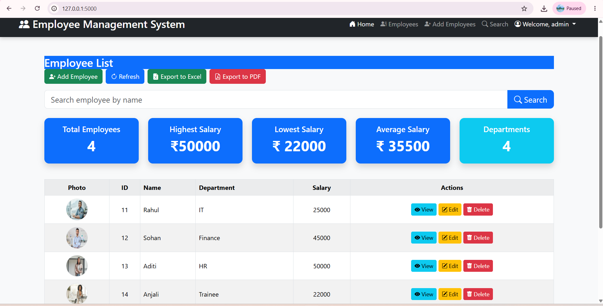
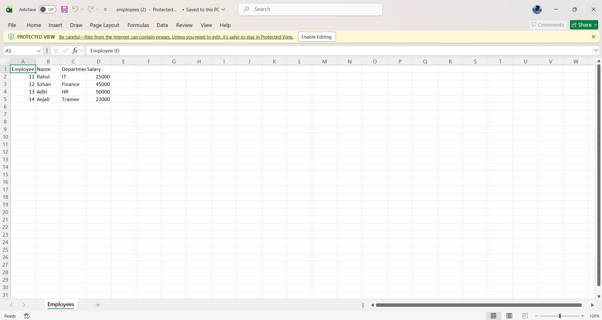
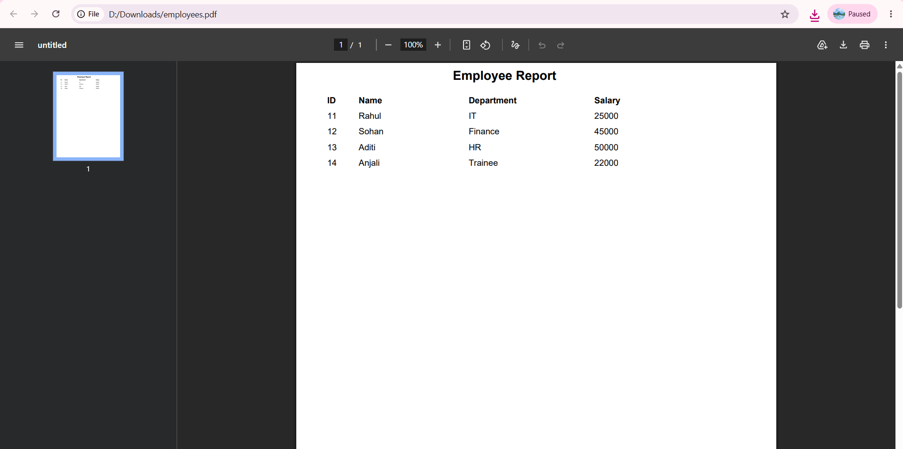

# 👨‍💼 Employee Management System

A full-stack Employee Management System built using **Python**, **Flask**, **SQL Server**, **Bootstrap 5**, and **GitHub**.

---

## 📌 Features

* 🔐 User Login Authentication
* ➕ Add Employee
* ✏️ Edit Employee
* ❌ Delete Employee
* 🔍 Search Employees
* 👤 Employee Details Page
* 📷 Upload Employee Photo
* 🖼️ Default Avatar Support
* 📊 Dashboard Statistics
* 📁 Export Employees to Excel
* 📄 Export Employees to PDF
* ⚠️ Custom 404 & 500 Error Pages
* 📱 Responsive Bootstrap Design

---

## 🛠 Technologies Used

* Python
* Flask
* SQL Server
* HTML5
* CSS3
* Bootstrap 5
* JavaScript
* Git
* GitHub
* OpenPyXL
* ReportLab

---

## 📸 Screenshots

### Login Page


---

### Dashboard



---

### Add Employee


---

### Employee Details


---

### Excel Export



---

### PDF Export



---

## 🚀 Installation

```bash
git clone https://github.com/YOUR_USERNAME/Employee-Management-System.git

cd Employee-Management-System

pip install -r requirements.txt

python app.py
```

---

## 📂 Project Structure

```text
EmployeeManagementSystem
│
├── app.py
├── requirements.txt
├── README.md
├── templates/
├── static/
│   └── uploads/
├── screenshots/
└── ...
```

---

## 👨‍💻 Author

**Prajwal Kumar**

GitHub: https://github.com/YOUR_USERNAME

